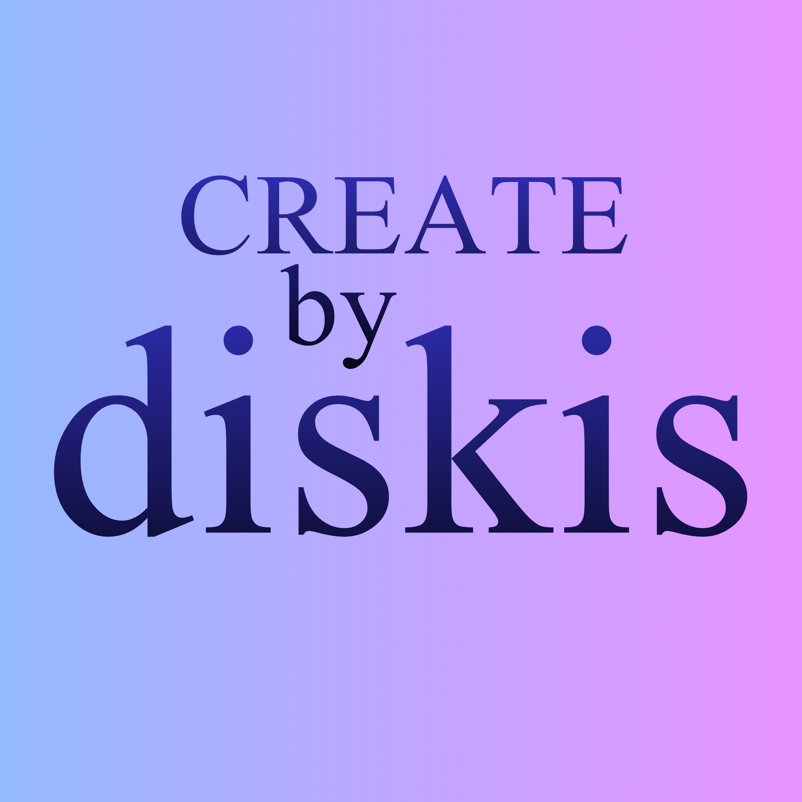

# bydiskis-tools

Interaktive Notion-Widgets von **diskis creative studio**.

## Tools

- **[lebensrad.html](lebensrad.html)** – tägliches Lebensrad-Tracking (Beruf, Beziehung, Soziales, Familie, Spaß, Produktivität, Gesundheit) mit Monats-, Quartals- und Jahresübersicht
- **[zyklus.html](zyklus.html)** – Zyklus- und Hormon-Tracker mit Phasenauswahl, Energie-/Laune-Reglern und Symptom-Checkliste

Beide Tools speichern alle Einträge lokal im Browser (`localStorage`) und lassen sich per Embed-Block direkt in Notion einbinden.
